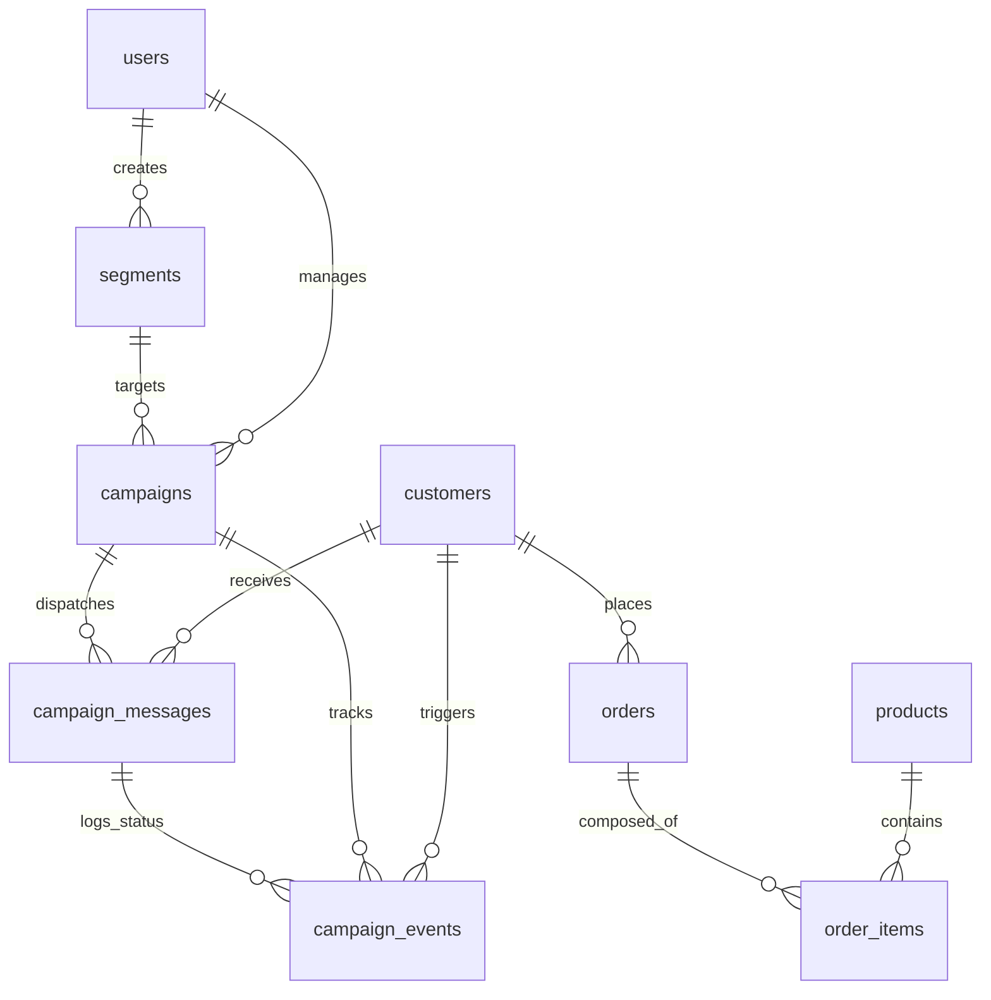

# FitStyle CRM — Database & Querying Guide

This document provides a detailed specification of the PostgreSQL database schema for **FitStyle CRM**, explaining the significance and structure of each table, and detailing the backend mechanics of how SQLAlchemy queries are constructed dynamically based on manager inputs.

---

## 📊 Part 1: Database Schema & Tables

The CRM uses **SQLAlchemy 2.0** to interface with PostgreSQL. There are 9 distinct database tables representing users, customers, products, transactions, saved target audiences, and message delivery states.



---

### 1. `users` Table
*   **Significance**: Stores authentication and organizational details for the CRM administrators/marketing managers.
*   **Fields & Parameters**:
    | Parameter | Type | Attributes | Description |
    | :--- | :--- | :--- | :--- |
    | `id` | `Integer` | Primary Key, Indexed | Unique identifier for the user. |
    | `name` | `String(255)` | Non-nullable | Full name of the manager. |
    | `email` | `String(255)` | Non-nullable, Unique, Indexed | Login email credentials. |
    | `hashed_password`| `String(255)` | Non-nullable | Bcrypt hashed login password. |
    | `company_name` | `String(255)` | Non-nullable | The company name they represent (e.g., FitStyle). |
    | `created_at` | `DateTime` | timezone=True, Server Default | Timestamp of account registration. |

---

### 2. `customers` Table
*   **Significance**: The CRM's customer database (1,000 auto-seeded Indian customers).
*   **Fields & Parameters**:
    | Parameter | Type | Attributes | Description |
    | :--- | :--- | :--- | :--- |
    | `id` | `Integer` | Primary Key, Indexed | Unique identifier for the customer. |
    | `name` | `String(255)` | Non-nullable | Customer's full name. |
    | `email` | `String(255)` | Non-nullable, Unique, Indexed | Customer's email address. |
    | `phone` | `String(20)` | Nullable | Contact number (used for WhatsApp/SMS channels). |
    | `city` | `String(100)` | Nullable | City of residence (e.g., Mumbai, Bangalore). |
    | `created_at` | `DateTime` | timezone=True, Server Default | The date/time the customer record was created. |
*   **Relationships**:
    *   `orders`: One-to-Many relationship with the `Order` model (eager-loaded via `selectin`).

---

### 3. `products` Table
*   **Significance**: Stores the inventory of item catalogs.
*   **Fields & Parameters**:
    | Parameter | Type | Attributes | Description |
    | :--- | :--- | :--- | :--- |
    | `id` | `Integer` | Primary Key, Indexed | Unique identifier for the product. |
    | `name` | `String(255)` | Non-nullable | Product title (e.g., Running Shoes). |
    | `category` | `String(100)` | Non-nullable, Indexed | Inventory group (Footwear, Clothing, Accessories). |
    | `price` | `Float` | Non-nullable | Price of the product in INR (₹). |

---

### 4. `orders` Table
*   **Significance**: Header record for purchases containing total invoice value and date.
*   **Fields & Parameters**:
    | Parameter | Type | Attributes | Description |
    | :--- | :--- | :--- | :--- |
    | `id` | `Integer` | Primary Key, Indexed | Unique order invoice number. |
    | `customer_id` | `Integer` | Foreign Key (`customers.id`), Indexed | Links the order to a customer. |
    | `total_amount` | `Float` | Non-nullable | Total cost of the order. |
    | `order_date` | `DateTime` | timezone=True, Server Default | Timestamp of purchase completion. |
*   **Relationships**:
    *   `customer`: Links back to `Customer`.
    *   `items`: One-to-Many relationship with `OrderItem` (eager-loaded via `selectin`).

---

### 5. `order_items` Table
*   **Significance**: Line items mapping the exact products purchased in an order.
*   **Fields & Parameters**:
    | Parameter | Type | Attributes | Description |
    | :--- | :--- | :--- | :--- |
    | `id` | `Integer` | Primary Key, Indexed | Unique identifier for the line item. |
    | `order_id` | `Integer` | Foreign Key (`orders.id`), Indexed | Links item back to its parent order header. |
    | `product_id` | `Integer` | Foreign Key (`products.id`) | Links back to the specific product details. |
    | `quantity` | `Integer` | Non-nullable, default=1 | Quantity of product bought. |
    | `price` | `Float` | Non-nullable | Purchase price per unit (at order time). |
*   **Relationships**:
    *   `order`: Links back to `Order`.
    *   `product`: Eager-loaded (`selectin`) link to the `Product` model.

---

### 6. `segments` Table
*   **Significance**: Holds target audience groups defined by filters (rules) or AI prompts.
*   **Fields & Parameters**:
    | Parameter | Type | Attributes | Description |
    | :--- | :--- | :--- | :--- |
    | `id` | `Integer` | Primary Key, Indexed | Unique identifier for the segment. |
    | `name` | `String(255)` | Non-nullable | Segment title given by the manager. |
    | `description` | `String(1000)`| Nullable | Description of the target segment's purpose. |
    | `filters` | `JSON` | Non-nullable | JSON payload array containing the segmentation rules. |
    | `customer_count`| `Integer` | Default=0 | Cached total number of matching customers. |
    | `created_by` | `Integer` | Foreign Key (`users.id`) | The ID of the manager who built the segment. |
    | `created_at` | `DateTime` | timezone=True, Server Default | Creation timestamp. |

---

### 7. `campaigns` Table
*   **Significance**: Represents a marketing campaign sent to a specific segment over a channel.
*   **Fields & Parameters**:
    | Parameter | Type | Attributes | Description |
    | :--- | :--- | :--- | :--- |
    | `id` | `Integer` | Primary Key, Indexed | Unique identifier for the campaign. |
    | `name` | `String(255)` | Non-nullable | Name of the campaign. |
    | `segment_id` | `Integer` | Foreign Key (`segments.id`) | Target segment being contacted. |
    | `channel` | `String(50)` | Non-nullable | Messaging medium (`whatsapp`, `email`, `sms`, `rcs`). |
    | `status` | `String(50)` | Default="DRAFT" | Operational stage: `DRAFT`, `SENDING`, `SENT`, `FAILED`. |
    | `subject` | `String(500)` | Nullable | Email subject line (if channel is Email). |
    | `generated_message`| `Text` | Nullable | Message body (with `{{name}}` template variables). |
    | `audience_size` | `Integer` | Default=0 | Number of recipients. |
    | `created_by` | `Integer` | Foreign Key (`users.id`) | Manager who launched the campaign. |
    | `created_at` | `DateTime` | timezone=True, Server Default | Creation timestamp. |
*   **Relationships**:
    *   `segment`: Eager-loaded (`selectin`) link to `Segment`.
    *   `messages`: One-to-Many link to `CampaignMessage` records.
    *   `events`: One-to-Many dynamic query mapping to `CampaignEvent` records.

---

### 8. `campaign_messages` Table
*   **Significance**: Tracks individual personalized copies sent to each customer.
*   **Fields & Parameters**:
    | Parameter | Type | Attributes | Description |
    | :--- | :--- | :--- | :--- |
    | `id` | `Integer` | Primary Key, Indexed | Unique identifier for the individual message. |
    | `campaign_id` | `Integer` | Foreign Key (`campaigns.id`), Indexed | Parent campaign ID. |
    | `customer_id` | `Integer` | Foreign Key (`customers.id`) | Recipient customer. |
    | `message` | `Text` | Non-nullable | The customized message with templates resolved. |
    | `status` | `String(50)` | Default="PENDING" | Status reported by external channel service. |
    | `sent_at` | `DateTime` | Nullable | Dispatch timestamp. |
*   **Relationships**:
    *   `campaign`: Links back to `Campaign`.
    *   `customer`: Eager-loaded (`selectin`) link to `Customer`.

---

### 9. `campaign_events` Table
*   **Significance**: Action telemetry logs storing webhook responses from delivery gateways.
*   **Fields & Parameters**:
    | Parameter | Type | Attributes | Description |
    | :--- | :--- | :--- | :--- |
    | `id` | `Integer` | Primary Key, Indexed | Unique event ID. |
    | `campaign_id` | `Integer` | Foreign Key (`campaigns.id`), Indexed | Associated campaign. |
    | `customer_id` | `Integer` | Foreign Key (`customers.id`) | Customer who took/triggered the action. |
    | `message_id` | `Integer` | Foreign Key (`campaign_messages.id`), Nullable | Linked to the original dispatched message. |
    | `status` | `String(50)` | Non-nullable | The state: `SENT`, `DELIVERED`, `OPENED`, `CLICKED`, `CONVERTED`, `FAILED`. |
    | `timestamp` | `DateTime` | timezone=True, Server Default | Webhook callback arrival timestamp. |
*   **Relationships**:
    *   `campaign`: Links back to `Campaign`.
    *   `customer`: Eager-loaded (`selectin`) link to `Customer`.

---

## 🔍 Part 2: Backend Query Construction (Dynamic Segmentation)

When a marketing manager queries customers (via AI or manual visual filters), the backend translates those rules into SQL statements using SQLAlchemy.

Every request runs through the `apply_filters(db, filters)` function in [segment_service.py](file:///c:/Users/susha/OneDrive/Desktop/Resume%20Level%20Project/CRM/backend/app/services/segment_service.py). This function constructs queries for each filter rule, fetches sets of matching customer IDs, and intersects them using **AND logic**.

Here is how each filter condition is generated and queried:

### Case 1: Total Spend (`total_spend`)
*   **Manager Input**: Customers who spent more than ₹5,000 (`total_spend > 5000`).
*   **Backend SQL translation**:
    ```sql
    SELECT orders.customer_id 
    FROM orders 
    GROUP BY orders.customer_id 
    HAVING sum(orders.total_amount) > 5000.0;
    ```
*   **SQLAlchemy implementation**:
    ```python
    subq = (
        select(Order.customer_id)
        .group_by(Order.customer_id)
        .having(func.sum(Order.total_amount) > float(value))
    )
    ```

---

### Case 2: Order Count (`order_count`)
*   **Manager Input**: Customers who made 3 or more purchases (`order_count >= 3`).
*   **Backend SQL translation**:
    ```sql
    SELECT orders.customer_id 
    FROM orders 
    GROUP BY orders.customer_id 
    HAVING count(orders.id) >= 3;
    ```
*   **SQLAlchemy implementation**:
    ```python
    subq = (
        select(Order.customer_id)
        .group_by(Order.customer_id)
        .having(func.count(Order.id) >= int(value))
    )
    ```

---

### Case 3: Inactivity Duration (`last_purchase_days`)
*   **Manager Input**: Customers inactive for more than 60 days (`last_purchase_days > 60`).
*   **Backend SQL translation**:
    The backend first computes a cutoff timestamp: `cutoff = datetime.now() - 60 days`.
    ```sql
    SELECT orders.customer_id 
    FROM orders 
    GROUP BY orders.customer_id 
    HAVING max(orders.order_date) < :cutoff_date;
    ```
*   **SQLAlchemy implementation**:
    ```python
    cutoff = datetime.now(timezone.utc) - timedelta(days=int(value))
    subq = (
        select(Order.customer_id)
        .group_by(Order.customer_id)
        .having(func.max(Order.order_date) < cutoff)
    )
    ```

---

### Case 4: Product Category (`product_category`)
*   **Manager Input Case A (Positive match)**: Customers who bought *Footwear* (`product_category in ["Footwear"]`).
    *   **Backend SQL translation**:
        ```sql
        SELECT DISTINCT orders.customer_id 
        FROM orders 
        JOIN order_items ON order_items.order_id = orders.id 
        JOIN products ON products.id = order_items.product_id 
        WHERE products.category IN ('Footwear');
        ```
    *   **SQLAlchemy implementation**:
        ```python
        subq = (
            select(distinct(Order.customer_id))
            .join(OrderItem, OrderItem.order_id == Order.id)
            .join(Product, Product.id == OrderItem.product_id)
            .where(Product.category.in_(categories))
        )
        ```
*   **Manager Input Case B (Negative match)**: Customers who have never bought *Accessories* (`product_category not_in ["Accessories"]`).
    *   **Backend Strategy**:
        To identify who has *not* bought accessories, the system executes two queries:
        1. Selects the distinct list of customers who *did* buy Accessories (`bought_ids`).
        2. Selects all customer IDs in the database (`all_ids`).
        3. Subtracts `bought_ids` from `all_ids` using Python set operators: `ids = all_ids - bought_ids`.
    *   **SQL translation for bought list**:
        ```sql
        SELECT DISTINCT orders.customer_id 
        FROM orders 
        JOIN order_items ON order_items.order_id = orders.id 
        JOIN products ON products.id = order_items.product_id 
        WHERE products.category IN ('Accessories');
        ```

---

### Case 5: Product Name (`product_name`)
*   **Manager Input**: Customers who bought *Running Shoes* (`product_name in ["Running Shoes"]`).
*   **Backend SQL translation**:
    ```sql
    SELECT DISTINCT orders.customer_id 
    FROM orders 
    JOIN order_items ON order_items.order_id = orders.id 
    JOIN products ON products.id = order_items.product_id 
    WHERE products.name IN ('Running Shoes');
    ```
*   **SQLAlchemy implementation**:
    ```python
    subq = (
        select(distinct(Order.customer_id))
        .join(OrderItem, OrderItem.order_id == Order.id)
        .join(Product, Product.id == OrderItem.product_id)
        .where(Product.name.in_(products))
    )
    ```

---

### Case 6: Location (`city`)
*   **Manager Input**: Customers residing in *Mumbai* or *Bangalore* (`city in ["Mumbai", "Bangalore"]`).
*   **Backend SQL translation**:
    ```sql
    SELECT customers.id 
    FROM customers 
    WHERE customers.city IN ('Mumbai', 'Bangalore');
    ```
*   **SQLAlchemy implementation**:
    ```python
    subq = select(Customer.id).where(Customer.city.in_(cities))
    ```

---

### Combining Multiple Filters (Set Intersection)
When a manager uses multiple filters, the backend resolves each rule independently to get matching customer ID sets, then uses the mathematical bitwise AND (`&`) operator in Python to intersect them.

*Example*: Filter A (Mumbai residency) yields `{1, 5, 8, 12, 15}`. Filter B (Spend > 5000) yields `{3, 5, 12, 19}`.
The intersected result returns `{5, 12}`.

```python
# Iterative intersection logic
if customer_ids is None:
    customer_ids = ids
else:
    customer_ids = customer_ids & ids
```
This ensures the final query is highly optimized and correctly represents the `AND` conjunction across all criteria.
