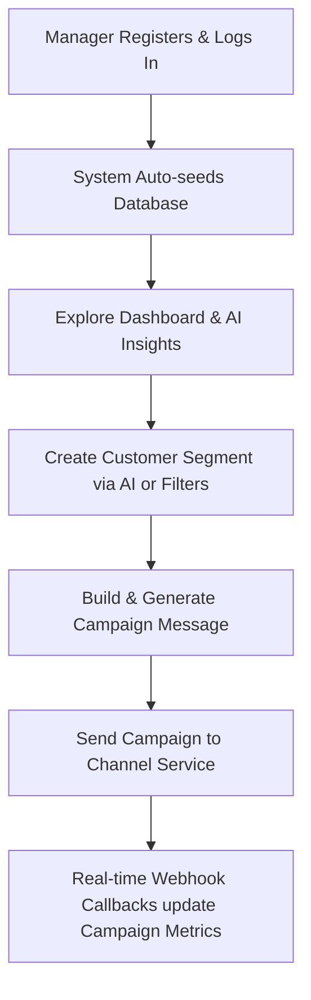

# FitStyle CRM — Project Guide & Functional Overview

Welcome to the **FitStyle CRM** guide! This document provides a complete breakdown of the project’s objectives, architecture, post-registration manager workflow, key features, demo scenarios, microservice communication model, and ideas for future enhancements.

---

## 🏗️ 1. Project Objectives & How They Are Achieved

### The Objective
Traditional Customer Relationship Management (CRM) platforms are often static CRUD (Create, Read, Update, Delete) databases. They require marketing managers to write SQL queries or navigate complex filters to segment customers, and manually write copies for each marketing channel.

**FitStyle CRM** is an **AI-Native Marketing Automation Platform** designed for a retail sports/athletic fashion brand. Its objectives are:
1. **Low-friction Customer Segmentation**: Let marketing managers find high-intent audiences using natural language (AI-Build).
2. **Instant Hyper-Personalized Messaging**: Use Large Language Models (LLMs) to instantly draft marketing copy tailored to a segment and delivery channel (WhatsApp, Email, SMS, RCS).
3. **Real-World Infrastructure Simulation**: Simulate external message gateways (like Twilio or SendGrid) to demonstrate how asynchronous delivery events and conversion tracking flow back into a CRM via webhooks.

### How They Are Achieved
The objectives are achieved through a three-tier decoupled architecture:
*   **React + Vite Frontend (Port 5173)**: A responsive single-page application built with React, TypeScript, TailwindCSS, and Recharts. It provides a visual dashboard, an AI Copilot chat window, interactive segment previewers, and realtime campaign funnels.
*   **FastAPI CRM Backend (Port 8000)**: Serves a REST API, manages database storage (PostgreSQL), interfaces with the AI provider (OpenAI or Groq) to handle segmentation parsing, customer summary generation, and copy generation, and exposes webhook endpoints to ingest delivery receipts.
*   **FastAPI Channel Service Microservice (Port 8001)**: A standalone service acting as a mock telecom gateway. It receives messages to deliver, simulates network latency and delivery probabilities, and posts status webhooks back to the backend.

---

## 🚀 2. Post-Registration Workflow (The Manager's Journey)

Once a Company's Marketing Manager registers and signs in, the platform immediately sets up their playground:



### 1. Registration & Login
When a manager registers at `/register` and logs in at `/login`, the system generates a secure JWT token, saving it in the browser context. This identifies the manager on subsequent API calls.

### 2. Automatic Seeding (Instant Sandbox)
On backend startup, if the database is empty, the seed script (`seed_data.py`) automatically populates the PostgreSQL database with:
*   **20 Products**: Categorized under *Footwear* (e.g., Running Shoes, Trail Shoes), *Clothing* (e.g., Jackets, Track Pants), and *Accessories* (e.g., Sports Bags, Fitness Bands).
*   **1,000 Customers**: Seeded with realistic Indian names, phone numbers, and cities (Mumbai, Bangalore, Noida, etc.).
*   **5,000 Orders**: Generated randomly over the past 12 months, assigning products, pricing, and purchase histories to the 1,000 customers.
This enables immediate use of analytics, segment builders, and campaigns without requiring manual data entry.

---

## 🛠️ 3. Core Features & How to Use Them

### 📈 Dashboard & AI Insights
*   **What it is**: The manager's command center displaying KPIs (Total Revenue, Active Customers, Conversion Rates, Campaign Metrics).
*   **AI Integration**: Below the charts, the CRM runs a background analysis on your data. The LLM processes overall campaign metrics and returns 4-6 actionable **AI Insights** (e.g., *"WhatsApp campaigns show 2.4x higher engagement than Email"*).
*   **How to use it**: Review the conversion funnel and click-through rates. Use the generated insights to decide which channel and customer segments to target next.

### 👥 Customer Directory & AI Summaries
*   **What it is**: A list of all 1,000 customers, filterable by city, spend, and name.
*   **AI Integration**: Clicking on any customer opens their detail page. Along with a list of recent orders, the system triggers the LLM to generate an **AI Analyst Summary Card**. It reads their statistics (total spend, average order value, order count, favorite categories, and top products) to output a 2-3 sentence behavior evaluation and **Churn Risk** level (Low, Medium, High).
*   **How to use it**: Use this to research specific VIP customers or investigate why a customer's churn risk is flagged as "High".

### 🎯 Segment Builder (Traditional & AI-Build)
*   **What it is**: A screen to group customers based on purchase behavior, spend, location, or inactivity.
*   **Traditional Mode**: Managers select manual filters (e.g., `City = Bangalore`, `Total Spend > 5000`).
*   **AI-Build Mode**: Managers type a natural language sentence into a search box. The LLM parses it into structured filters.
    *   *Input Example*: `Find customers in Mumbai who bought running shoes but not accessories`
    *   *Parsed Output*:
        ```json
        [
          {"field": "city", "operator": "in", "value": ["Mumbai"]},
          {"field": "product_name", "operator": "in", "value": ["Running Shoes"]},
          {"field": "product_category", "operator": "not_in", "value": ["Accessories"]}
        ]
        ```
    *   *Real-time Preview*: Displays matching customer count and a list of matching profiles instantly before saving.

### 🤖 AI Copilot
*   **What it is**: An interactive, brand-aware chat interface.
*   **How to use it**: Ask the Copilot strategy questions like *"What campaign should I run for inactive customers in Delhi?"* or *"Give me a catchy subject line for a sportswear launch on WhatsApp"*. The Copilot is pre-prompted with FitStyle's product catalog and categories, allowing it to provide relevant recommendations.

---

## ✉️ 4. The Campaign Section: How it Works

The Campaign section is the operational engine of the CRM. It orchestrates drafting, copywriting, sending, and tracking marketing messages.

### Step 1: Create a Draft
A manager names a campaign, selects a target customer segment (built in the previous step), and selects the distribution channel (WhatsApp, Email, SMS, or RCS).

### Step 2: AI Content Generation (The Copywriter)
Instead of writing the message body manually, the manager clicks **"Generate Content"**. The backend queries the LLM with details about the segment (e.g., segment name, description, size) and the selected channel. The AI returns a JSON payload containing:
1.  **A Campaign Title**
2.  **A Subject Line** (used for Emails)
3.  **A Message Body**: Automatically structured with templating variables like `{{name}}` and `{{favorite_category}}`.
*Example generated message for Email:*
> "Hi {{name}}! Ready to upgrade your fitness game? Check out our latest collection of {{favorite_category}} at FitStyle. Enjoy 20% off today!"

### Step 3: Dispatch & Personalization
When the manager clicks **"Send Campaign"**, the backend spawns a background thread:
1.  It queries the database to retrieve all customer details belonging to the selected segment.
2.  It iterates through each customer.
3.  It personalizes the message body by replacing `{{name}}` with the customer's actual name and `{{favorite_category}}` with their computed favorite product category.
4.  It creates a `CampaignMessage` record in the database with status `SENT`.
5.  It forwards the personalized message to the **Channel Service** microservice via an HTTP POST request.

---

## ⚡ 5. The Channel-Service: Significance & Mechanics

### Why does the Channel-Service exist? (Significance)
In a real-world enterprise environment:
1.  **Decoupled Architecture**: CRMs do not dispatch SMS or Emails directly from their main database web servers. Doing so is slow, clogs threads, and is vulnerable to API failures. Instead, they hand messages over to third-party telecommunication gateways (e.g., Twilio, SendGrid, Gupshup).
2.  **Asynchronous Lifecycle**: Sending a message is only the beginning. The message must travel through a lifecycle: **Sent ➔ Delivered ➔ Opened ➔ Link Clicked ➔ Converted (Purchase Made)**.
3.  **Webhooks**: External gateways notify the CRM of these lifecycle events asynchronously using Webhooks (HTTP callback POSTs).

The **Channel Service** mimics a third-party gateway to demonstrate this exact production-grade architecture locally without requiring paid API keys or actual SMS charges.

### How the Channel-Service works under the hood (Mechanics)

```
┌─────────────┐             POST /send              ┌─────────────────┐
│ CRM Backend │────────────────────────────────────▶│ Channel Service │
│  (FastAPI)  │                                     │  (Microservice) │
└─────────────┘                                     └────────┬────────┘
       ▲                                                     │
       │                                                     │ Spawns
       │ POST /api/campaign-events                           │ Async Simulator
       │ (Webhook Updates: DELIVERED, OPENED, etc.)         │
       └─────────────────────────────────────────────────────▼
```

1.  **Ingestion**: The CRM backend calls `POST http://localhost:8001/send` containing the `campaign_id`, `message_id`, `customer_id`, `channel`, and the personalized message text.
2.  **Background Queuing**: The Channel Service responds with `202 Accepted` immediately so the CRM backend isn't blocked. It schedules an asynchronous simulator run in the background.
3.  **Delay & Lifecycle Simulation**: The simulator (`simulator.py`) mimics real customer behaviors using channel-specific probabilities and random delays:
    *   **WhatsApp**: High open rate (72%) and high conversion rate (12%).
    *   **Email**: Medium open rate (45%) and lower conversion rate (8%).
    *   **SMS**: High open rate (65%) but very low click-through rate (10%).
    *   **RCS**: Emerging high-engagement channel (55% open rate, 22% click rate).
4.  **Webhook Callbacks**: As the simulation progresses, the Channel Service issues HTTP POST requests back to the CRM backend's webhook endpoint (`http://localhost:8000/api/campaign-events`):
    *   *Step 1 (Delay 1-5s)*: Fires a callback with status **DELIVERED** (or **FAILED**).
    *   *Step 2 (Delay 1-3s)*: Fires a callback with status **OPENED** (if open check passes).
    *   *Step 3 (Delay 0.5-2s)*: Fires a callback with status **CLICKED** (if click check passes).
    *   *Step 4 (Delay 0.5-1s)*: Fires a callback with status **CONVERTED** (if conversion check passes).
5.  **CRM Update**: The CRM backend receives these webhooks, inserts event records into `CampaignEvent`, updates the corresponding message statuses, and updates the Campaign's realtime dashboard charts.

---

## 📝 6. Concrete Demo Example (Input & Expected Output)

Let's run through a walk-through scenario:

### 1. The Goal
Promote a new line of premium running sneakers to high-spending athletic shoppers located in Mumbai.

### 2. Step-by-Step Inputs

#### Step A: Build the Segment
1.  Go to the **Segments** page.
2.  In the **AI Segment Builder**, type:
    > `"Find customers in Mumbai who spent more than 4000 and bought Running Shoes"`
3.  Click **AI-Build**.
4.  *Expected Output*: The AI parses the request and populates the filters. The preview counts update (e.g., "Found 47 customers in Mumbai matching criteria").
5.  Enter the name `Mumbai Premium Runners` and click **Save Segment**.

#### Step B: Create and Launch the Campaign
1.  Go to the **Campaigns** page and click **Create Campaign**.
2.  **Campaign Name**: `Monsoon Sneaker Launch`
3.  **Select Segment**: `Mumbai Premium Runners`
4.  **Channel**: `WhatsApp`
5.  Click **Generate Content**.
    *   *Expected Output*: The AI writes a message template:
        > "Hi {{name}}! 🌧️ Don't let the monsoon slow down your runs. Check out our waterproof Running Shoes. Use code RUNMUMBAI for 15% off!"
6.  Click **Create & Send Campaign**.

### 3. Behind the Scenes Execution & Output
*   The Campaign status updates to `SENDING`.
*   The CRM backend grabs the 47 customers, replaces `{{name}}` with individual names (e.g., *"Hi Rajesh!"*, *"Hi Anjali!"*), and fires 47 HTTP posts to the Channel Service.
*   The Campaign status transitions to `SENT`.
*   **The Telemetry Stream (Callbacks)**:
    *   Within 2-3 seconds, you will see the **Delivered** stat count on the Campaign detail page rise to ~45 (reflecting WhatsApp's 95% delivery rate).
    *   A few seconds later, the **Opened** count will climb to ~32 (72% open rate).
    *   Shortly after, the **Clicked** count increases to ~9 (28% click rate).
    *   Finally, the **Converted** count reaches ~3 or 4 (12% conversion rate).
*   The manager sees a live update of the conversion funnel, allowing them to verify exactly how many customers completed a purchase.

---

## 🔮 7. Future Improvements & Features

If you want to scale this project into a commercial SaaS or add high-impact portfolio features, here is what should be implemented:

### 1. Real Channel Integrations (Production Gateways)
*   **Twilio SMS/WhatsApp**: Replace the simulated Channel Service endpoints with the official Twilio API.
*   **Amazon SES or SendGrid**: Wire up email dispatch to allow real emails to be sent to customers with trackable tracking pixels (embedded transparent 1x1 image) to catch actual `OPENED` and `CLICKED` events.

### 2. Multi-Tenant SaaS Capability
*   **Workspace Separation**: Allow multiple distinct retail companies to register, upload their own custom product databases, and isolate their data.
*   **Role-Based Access Control (RBAC)**: Create roles for Team Members (e.g., `Analyst` who can view data, `Editor` who can draft campaigns, and `Admin` who can execute sends and configure API keys).

### 3. Drag-and-Drop Automated Customer Journeys
*   Build a visual journey map (similar to HubSpot or Klaviyo):
    *   *Trigger*: Customer places their first order.
    *   *Action*: Wait 3 days.
    *   *Check*: Did they buy Footwear?
        *   *If Yes*: Send a WhatsApp offer for shoe cleaner accessories.
        *   *If No*: Send an Email introducing best-selling sneakers.

### 4. Advanced AI SQL Generator & Dynamic Segmentation
*   Rather than restricting natural language queries to simple field filters, use a text-to-SQL system. The AI would safely translate prompts like *"Find customers who spent more this month than their average over the past 6 months"* into read-only PostgreSQL queries, enabling limitless segmentation power.

### 5. Machine Learning Insights (Predictive Churn & LTV)
*   Train a local ML model (like XGBoost or a regression model) on the order history database.
*   Predict **Customer Lifetime Value (CLV)** to highlight the top 5% value generators.
*   Predict a data-driven **Churn Probability Score** based on recency, frequency, and monetary (RFM) parameters instead of basic heuristics.

### 6. A/B Testing Engine
*   Allow managers to split a segment into two groups (Group A and Group B).
*   Generate two distinct AI message tones (e.g., *Urgent* vs. *Casual*) and compare click-through and conversion metrics side-by-side to optimize marketing copy.
