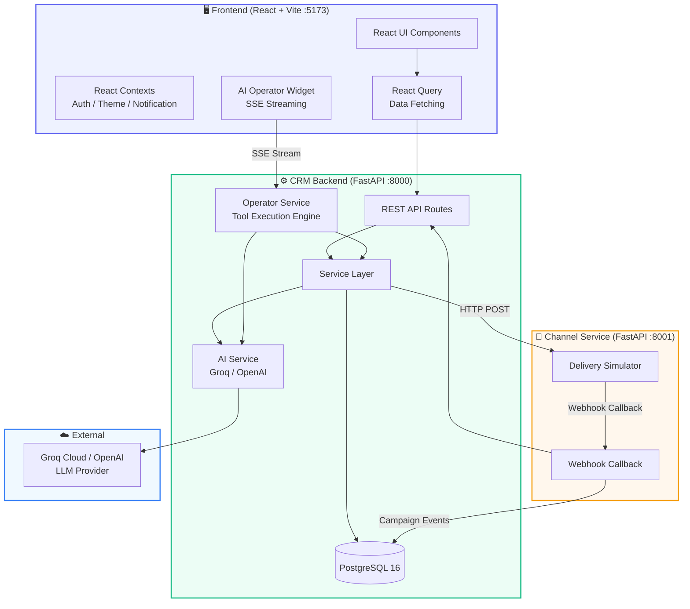
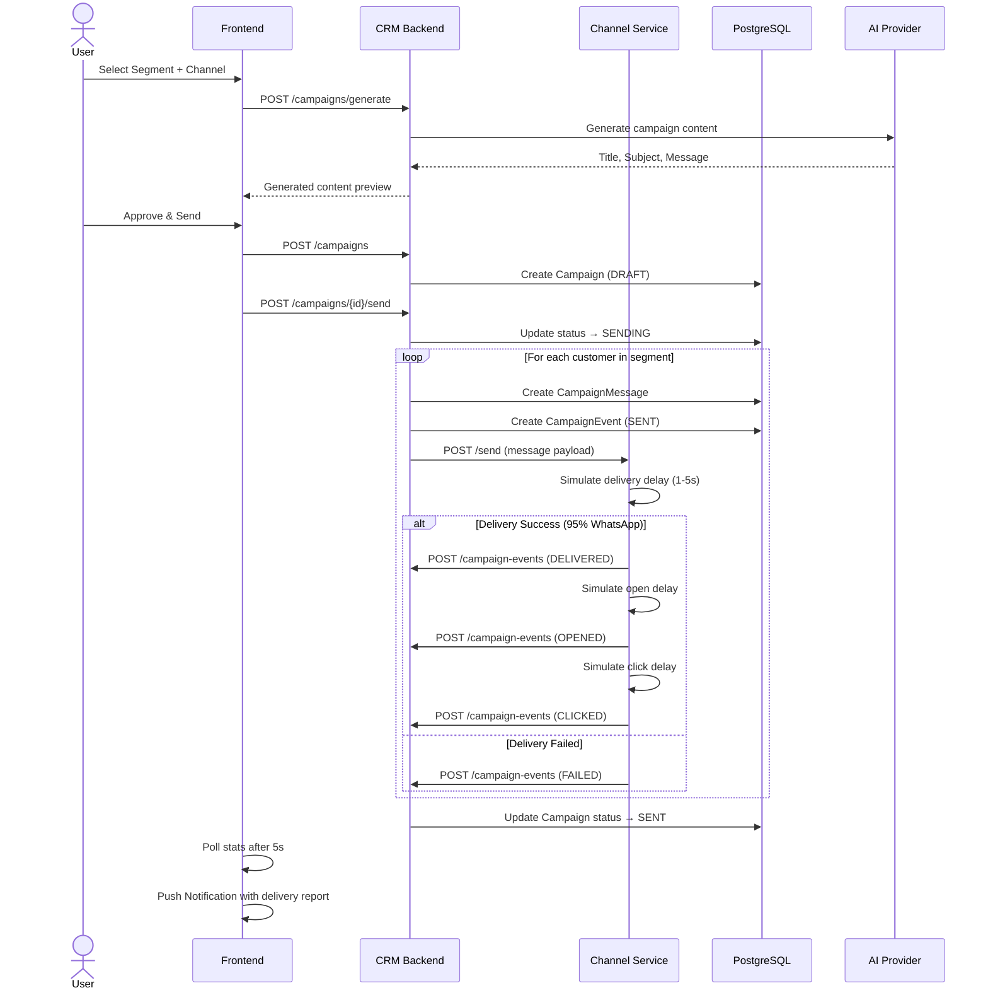
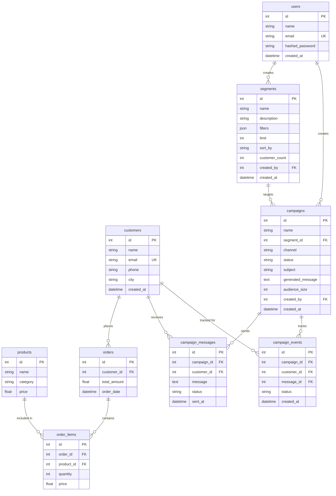
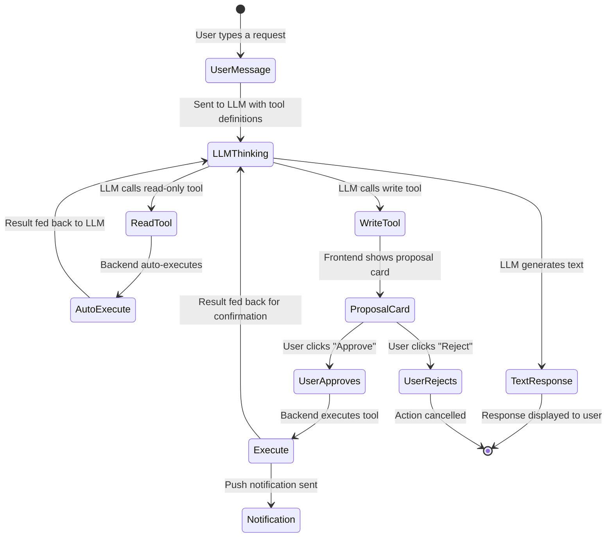
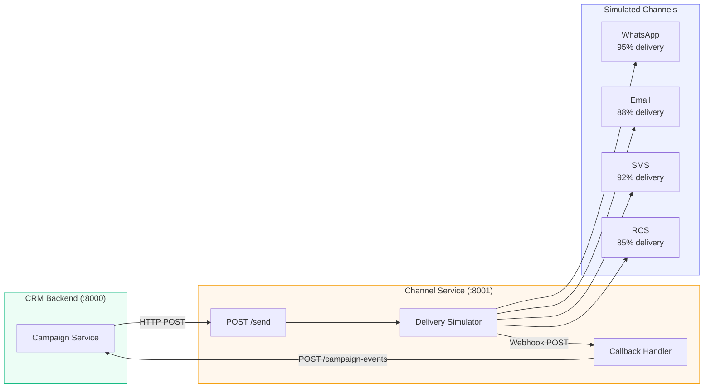

<div align="center">

# ⚡ FitStyle CRM — AI-Native Marketing Platform

### *The CRM that markets for you.*

[](https://react.dev)
[](https://fastapi.tiangolo.com)
[](https://postgresql.org)
[](https://docker.com)
[](https://typescriptlang.org)

A **production-grade, AI-powered Mini CRM** for **FitStyle** — a retail fashion brand specializing in athletic and sports wear. Features an autonomous AI marketing agent, multi-channel campaign delivery, real-time analytics, and a stunning dark/light mode interface.

</div>

---

## 📑 Table of Contents

- [✨ Features at a Glance](#-features-at-a-glance)
- [🏗️ System Architecture](#️-system-architecture)
  - [High-Level Architecture](#high-level-architecture)
  - [Low-Level Design: Campaign Send Flow](#low-level-design-campaign-send-flow)
- [🗄️ Database Design](#️-database-design)
- [🤖 Agentic AI Workflows](#-agentic-ai-workflows)
  - [Tool Definitions](#tool-definitions)
  - [Human-in-the-Loop (HITL) Approval Flow](#human-in-the-loop-hitl-approval-flow)
  - [SSE Streaming Architecture](#sse-streaming-architecture)
- [🔌 Microservice Architecture](#-microservice-architecture)
- [🛣️ API Endpoints](#️-api-endpoints)
- [🛠️ Tech Stack](#️-tech-stack)
- [📂 Project Structure](#-project-structure)
- [🚀 Getting Started](#-getting-started)
- [🎬 Demo Walkthrough](#-demo-walkthrough)
- [🔑 Environment Variables](#-environment-variables)
- [📜 License](#-license)

---

## ✨ Features at a Glance

| # | Feature | Description |
|---|---------|-------------|
| 1 | **📊 Dashboard** | KPI cards, revenue charts, AI strategic briefs, quick actions |
| 2 | **👥 Customers** | Searchable customer list with paginated detail views, AI-powered summaries |
| 3 | **🛒 Orders** | Full order history with product details and spend analytics |
| 4 | **🎯 Segments** | Manual filter builder + AI natural language segment creator |
| 5 | **📢 Campaigns** | 3-step wizard: Select Segment → Choose Channel → AI Generate & Send |
| 6 | **📈 Analytics** | Funnel visualization, channel performance, segment analysis, AI insights |
| 7 | **🤖 FitStyle Agent** | Autonomous AI operator with tool calling, SSE streaming, and HITL approval |
| 8 | **💬 AI Copilot** | Conversational marketing assistant for ad-hoc queries |
| 9 | **🔔 Notifications** | Real-time notification center with unread badges and delivery reports |
| 10 | **🌓 Dark / Light Mode** | Full theme system with CSS variables and localStorage persistence |
| 11 | **🔐 Authentication** | JWT-based auth with register, login, and protected routes |
| 12 | **🌐 Landing Page** | Premium marketing site with 3D animations, scribble annotations, and AI showcases |

---

## 🏗️ System Architecture

### High-Level Architecture



### Low-Level Design: Campaign Send Flow



---

## 🗄️ Database Design



**Seed Data (Auto-loaded on first startup):**
- 🏷️ **20 Products** across Footwear, Clothing, Accessories
- 👥 **1,000 Customers** with realistic Indian demographics (names, cities, phones)
- 🛒 **5,000 Orders** spanning 12 months of purchase history

---

## 🤖 Agentic AI Workflows

The FitStyle Agent is an autonomous AI operator built with **function calling** and **Server-Sent Events (SSE)** streaming.

### Tool Definitions

| Tool | Type | Description | Auto-Execute? |
|------|------|-------------|---------------|
| `get_analytics_summary` | Read | Fetches CRM overview: total customers, revenue, active campaigns | ✅ Yes |
| `get_existing_segments` | Read | Retrieves all existing audience segments | ✅ Yes |
| `query_customers` | Read | Simulates a segment filter to count matching customers | ✅ Yes |
| `create_segment` | Write | Creates a new audience segment in the database | ❌ HITL Required |
| `draft_campaign` | Write | Creates a new draft campaign for a segment | ❌ HITL Required |

### Human-in-the-Loop (HITL) Approval Flow



### SSE Streaming Architecture

The AI Operator uses **Server-Sent Events** for real-time token-by-token streaming:

```
Frontend                          Backend                         LLM
   │                                │                              │
   │── POST /operator/chat ────────>│                              │
   │                                │── stream request ───────────>│
   │                                │                              │
   │<─ SSE: {type: "status"} ──────│                              │
   │<─ SSE: {type: "token"} ───────│<── token stream ────────────│
   │<─ SSE: {type: "token"} ───────│<── token stream ────────────│
   │<─ SSE: {type: "token"} ───────│<── token stream ────────────│
   │                                │                              │
   │   (if tool call detected)      │                              │
   │<─ SSE: {type: "proposal"} ────│  (write tool → pause)        │
   │                                │                              │
   │── POST /operator/execute ─────>│                              │
   │<─ {result} ───────────────────│                              │
   │                                │                              │
   │<─ SSE: [DONE] ────────────────│                              │
```

**Event Types:**
| Event | Description |
|-------|-------------|
| `token` | Individual text token from the LLM stream |
| `status` | Status message (e.g., "Running get_analytics_summary...") |
| `proposal` | Write tool proposal requiring user approval |
| `message_complete` | Full assistant message including tool_calls metadata |
| `error` | Error notification |
| `[DONE]` | Stream termination signal |

---

## 🔌 Microservice Architecture

The **Channel Service** is a dedicated FastAPI microservice that simulates multi-channel message delivery:



**Delivery Simulation Pipeline:**
1. Message received → Random network delay (1-5 seconds)
2. **DELIVERED** event (probabilistic per channel)
3. **OPENED** event (after 1-3 second delay)
4. **CLICKED** event (after 0.5-2 second delay)
5. **CONVERTED** event (after 0.5-1 second delay)
6. Each event is sent as a webhook callback to the CRM Backend

---

## 🛣️ API Endpoints

### Authentication
| Method | Endpoint | Description |
|--------|----------|-------------|
| `POST` | `/api/auth/register` | Register a new user |
| `POST` | `/api/auth/login` | Login and receive JWT token |

### Customers
| Method | Endpoint | Description |
|--------|----------|-------------|
| `GET` | `/api/customers` | List customers (paginated, searchable) |
| `GET` | `/api/customers/{id}` | Customer detail with AI summary |

### Orders
| Method | Endpoint | Description |
|--------|----------|-------------|
| `GET` | `/api/orders` | List orders (paginated) |

### Segments
| Method | Endpoint | Description |
|--------|----------|-------------|
| `GET` | `/api/segments` | List all segments |
| `POST` | `/api/segments` | Create segment with filters |
| `POST` | `/api/segments/ai-create` | AI-powered natural language segment creation |
| `POST` | `/api/segments/preview` | Preview segment filter results |

### Campaigns
| Method | Endpoint | Description |
|--------|----------|-------------|
| `GET` | `/api/campaigns` | List all campaigns with stats |
| `POST` | `/api/campaigns` | Create a new campaign |
| `POST` | `/api/campaigns/generate` | AI-generate campaign content |
| `GET` | `/api/campaigns/{id}` | Campaign detail with delivery stats |
| `POST` | `/api/campaigns/{id}/send` | Send campaign (background task) |

### Analytics
| Method | Endpoint | Description |
|--------|----------|-------------|
| `GET` | `/api/analytics/overview` | Dashboard KPIs |
| `GET` | `/api/analytics/channels` | Channel performance data |
| `GET` | `/api/analytics/insights` | AI-generated marketing insights |

### AI Operator
| Method | Endpoint | Description |
|--------|----------|-------------|
| `POST` | `/api/operator/chat` | SSE streaming chat with tool calling |
| `POST` | `/api/operator/execute` | Execute an approved tool call |
| `GET` | `/api/operator/brief` | AI-generated strategic brief |

### Campaign Events (Webhook)
| Method | Endpoint | Description |
|--------|----------|-------------|
| `POST` | `/api/campaign-events` | Receive delivery status webhooks |

---

## 🛠️ Tech Stack

| Layer | Technology | Purpose |
|-------|-----------|---------|
| **Frontend** | React 18, TypeScript, Vite | Core SPA framework |
| **Styling** | TailwindCSS + Custom CSS Variables | Responsive design + Dark/Light theme |
| **Charts** | Recharts | Data visualization (Bar, Funnel, Line) |
| **Animation** | Framer Motion | Page transitions, micro-interactions |
| **State** | React Query (TanStack) | Server state management + caching |
| **Contexts** | AuthContext, ThemeContext, NotificationContext | Client state management |
| **Backend** | FastAPI, Python 3.10+ | Async REST API server |
| **ORM** | SQLAlchemy 2.0 (Async) | Database abstraction |
| **Database** | PostgreSQL 16 | Relational data store |
| **AI** | Groq (Llama 3.3 70B) / OpenAI (GPT-4o-mini) | LLM for agent tool calling & content gen |
| **Auth** | JWT (python-jose) + bcrypt | Stateless authentication |
| **Channel Service** | FastAPI Microservice | Message delivery simulation |
| **Deployment** | Docker Compose | Multi-container orchestration |

---

## 📂 Project Structure

```
FitStyle-CRM/
├── 📄 docker-compose.yml          # Multi-container orchestration
├── 📄 .env                        # Environment configuration
├── 📄 README.md                   # This file
│
├── 🔧 backend/                    # CRM Backend (FastAPI)
│   ├── app/
│   │   ├── api/                   # Route handlers
│   │   │   ├── auth.py            #   Authentication (register/login)
│   │   │   ├── customers.py       #   Customer CRUD + AI summaries
│   │   │   ├── orders.py          #   Order listing
│   │   │   ├── segments.py        #   Segment CRUD + AI creation
│   │   │   ├── campaigns.py       #   Campaign CRUD + send
│   │   │   ├── analytics.py       #   Dashboard & channel analytics
│   │   │   ├── copilot.py         #   AI Copilot chat
│   │   │   ├── operator.py        #   AI Operator SSE streaming
│   │   │   ├── campaign_events.py #   Webhook receiver
│   │   │   └── products.py        #   Product listing
│   │   ├── core/                  # Infrastructure
│   │   │   ├── config.py          #   Settings (Pydantic)
│   │   │   ├── database.py        #   Async SQLAlchemy engine
│   │   │   ├── deps.py            #   Dependency injection
│   │   │   └── security.py        #   JWT + bcrypt
│   │   ├── models/                # SQLAlchemy ORM Models
│   │   │   ├── user.py            #   User model
│   │   │   ├── customer.py        #   Customer model
│   │   │   ├── product.py         #   Product model
│   │   │   ├── order.py           #   Order + OrderItem models
│   │   │   ├── segment.py         #   Segment model (JSON filters)
│   │   │   ├── campaign.py        #   Campaign + CampaignMessage
│   │   │   └── campaign_event.py  #   Delivery event tracking
│   │   ├── schemas/               # Pydantic request/response schemas
│   │   ├── services/              # Business logic layer
│   │   │   ├── ai_service.py      #   AI content generation
│   │   │   ├── analytics_service.py #  Analytics computations
│   │   │   ├── auth_service.py    #   Auth logic
│   │   │   ├── campaign_service.py#   Campaign orchestration
│   │   │   ├── channel_client.py  #   HTTP client → Channel Service
│   │   │   ├── customer_service.py#   Customer queries + AI summaries
│   │   │   ├── operator_service.py#   AI Agent tool execution engine
│   │   │   ├── order_service.py   #   Order queries
│   │   │   └── segment_service.py #   Segment filter engine
│   │   └── seed/                  # Data seeding (1K customers, 5K orders)
│   └── Dockerfile
│
├── 📡 channel-service/            # Channel Microservice (FastAPI)
│   └── app/
│       ├── main.py                # FastAPI app + /send endpoint
│       ├── simulator.py           # Probabilistic delivery simulator
│       ├── callback.py            # Webhook callback to CRM
│       ├── config.py              # Service configuration
│       └── schemas.py             # Request/response models
│
└── 🖥️ frontend/                   # React Frontend (Vite + TypeScript)
    └── src/
        ├── pages/                 # Route-level page components
        │   ├── DashboardPage.tsx   #   Main dashboard with KPIs
        │   ├── CustomersPage.tsx   #   Customer list + search
        │   ├── CustomerDetailPage.tsx # Customer profile + AI summary
        │   ├── OrdersPage.tsx      #   Order history table
        │   ├── SegmentsPage.tsx    #   Segment builder (manual + AI)
        │   ├── CampaignsPage.tsx   #   Campaign wizard + list
        │   ├── CampaignDetailPage.tsx # Campaign stats
        │   ├── AnalyticsPage.tsx   #   Full analytics dashboard
        │   ├── CopilotPage.tsx     #   AI Copilot chat interface
        │   ├── LoginPage.tsx       #   Login form
        │   ├── RegisterPage.tsx    #   Registration form
        │   └── landing/            #   Landing page sections
        │       ├── LandingPage.tsx
        │       ├── HeroSection.tsx
        │       ├── FeaturesSection.tsx
        │       ├── AICopilotShowcase.tsx
        │       ├── AgenticWorkflowSection.tsx
        │       ├── DashboardPreviewSection.tsx
        │       ├── AnalyticsShowcase.tsx
        │       ├── AIInsightsSection.tsx
        │       ├── CTASection.tsx
        │       └── Footer.tsx
        ├── components/
        │   ├── layout/
        │   │   ├── AppLayout.tsx    #   Shell: Sidebar + Topbar + Notifications
        │   │   └── Sidebar.tsx      #   Navigation sidebar
        │   └── operator/
        │       ├── AIOperatorWidget.tsx  # AI Agent chat drawer
        │       └── AIOperatorWidget.css # Agent styling + wave animation
        ├── contexts/
        │   ├── AuthContext.tsx      #   JWT auth state
        │   ├── ThemeContext.tsx     #   Dark/Light mode toggle
        │   └── NotificationContext.tsx # Global notification state
        └── lib/
            ├── api.ts              #   Axios instance with JWT interceptor
            ├── types.ts            #   TypeScript interfaces
            └── utils.ts            #   Formatters + helpers
```

---

## 🚀 Getting Started

### Option 1: Docker (Recommended)

```bash
# 1. Clone and configure
cp .env.example .env
# Edit .env with your GROQ_API_KEY or OPENAI_API_KEY

# 2. Start all services
docker compose up --build

# 3. Open in browser
# Frontend:       http://localhost:5173
# Backend Docs:   http://localhost:8000/docs
# Channel Docs:   http://localhost:8001/docs
```

### Option 2: Local Development

<details>
<summary><strong>Click to expand local setup instructions</strong></summary>

#### Prerequisites
- Python 3.10+, Node.js 18+, PostgreSQL running locally

#### 1. Configure Environment
```bash
cp .env.example .env
# Set GROQ_API_KEY or OPENAI_API_KEY
# Set POSTGRES_USER and POSTGRES_PASSWORD to match your local PostgreSQL
```

#### 2. CRM Backend
```bash
cd backend
python -m venv venv
# Windows: .\venv\Scripts\Activate.ps1
# Linux:   source venv/bin/activate
pip install -r requirements.txt
uvicorn app.main:app --host 127.0.0.1 --port 8000 --reload
```
> On first startup, the database is auto-created and seeded with 1K customers + 5K orders.

#### 3. Channel Service
```bash
cd channel-service
python -m venv venv
# Windows: .\venv\Scripts\Activate.ps1
# Linux:   source venv/bin/activate
pip install -r requirements.txt
uvicorn app.main:app --host 127.0.0.1 --port 8001 --reload
```

#### 4. Frontend
```bash
cd frontend
npm install
npm run dev
```

</details>

---

## 🎬 Demo Walkthrough

Here's a step-by-step journey through the FitStyle CRM:

### 1️⃣ Landing & Authentication
> Visit the landing page → Click "Start Free Demo" → Register a new account → Login

### 2️⃣ Dashboard Overview
> See your KPIs at a glance: Total Shoppers, Active Segments, Campaigns Sent, and Engagement Rate. The AI Strategic Brief provides automated marketing recommendations.

### 3️⃣ Create an AI Segment
> Navigate to **Segments** → Choose "AI Builder" → Type: *"Find customers in Mumbai who spent more than ₹5000"* → The AI parses your intent into filters and creates the segment automatically.

### 4️⃣ Launch a Campaign
> Navigate to **Campaigns** → Click "Create Campaign" → Select your new segment → Choose WhatsApp → AI generates the title, subject, and personalized message → Review and hit "Create & Send".

### 5️⃣ Watch Delivery in Real-Time
> The Channel Service simulates delivery. Within seconds, check your **Notification Bell** 🔔 for a delivery report: *"Delivered: 340, Failed: 12, Opened: 245"*.

### 6️⃣ Talk to the AI Operator
> Click the pulsing **FitStyle Agent** button (bottom-right) → Ask: *"What segments do we have?"* → The agent calls `get_existing_segments` automatically → Then ask: *"Create a campaign for high spenders via email"* → The agent proposes a `draft_campaign` action → Click **Approve** → Campaign created with a notification alert!

### 7️⃣ Analyze Performance
> Navigate to **Analytics** → View the delivery funnel (Sent → Delivered → Opened → Clicked → Converted) → Compare channel performance → Read AI-generated insights.

### 8️⃣ Toggle Dark Mode
> Click the **Sun/Moon icon** in the top navigation bar to switch between light and dark themes. Your preference is saved across sessions.

---

## 🔑 Environment Variables

| Variable | Description | Default |
|----------|-------------|---------|
| `AI_PROVIDER` | `groq` or `openai` | `groq` |
| `GROQ_API_KEY` | Groq Cloud API key | — |
| `OPENAI_API_KEY` | OpenAI API key | — |
| `JWT_SECRET` | JWT signing secret | auto-generated |
| `POSTGRES_USER` | PostgreSQL username | `fitstyle` |
| `POSTGRES_PASSWORD` | PostgreSQL password | `fitstyle_secret` |
| `POSTGRES_DB` | Database name | `fitstyle_crm` |
| `CHANNEL_SERVICE_URL` | Channel service URL | `http://localhost:8001` |

---

## 📜 License

MIT License — built with ❤️ for modern marketing teams.
